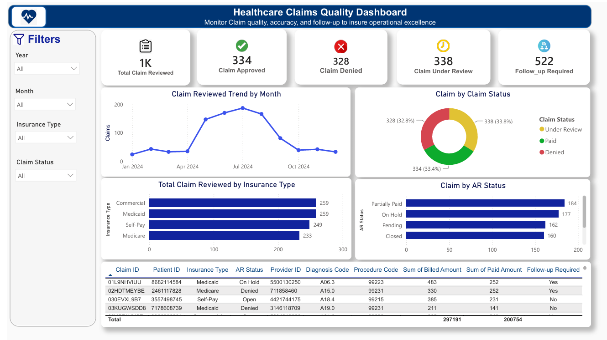

# Healthcare Claims Quality Dashboard

## Project Overview

This Power BI dashboard provides a high-level view of healthcare claim quality and claim review performance.

The dashboard helps monitor claim review activities, approval and denial trends, insurance-wise claim distribution, AR status, and follow-up requirements. It enables users to identify operational bottlenecks and monitor overall claim processing quality.

---

## Tools Used

- Power BI
- Power Query
- DAX
- Data Modeling

---

## Key KPIs

- Total Claims Reviewed
- Approved Claims
- Denied Claims
- Claims Under Review
- Follow-up Required

---

## Visualizations

- Claim Reviewed Trend by Month (Line Chart)
- Claim Status Distribution (Donut Chart)
- Claims by Insurance Type (Bar Chart)
- Claims by AR Status (Bar Chart)
- Claim Details Table

---

## DAX Measures Used

### Total Claims Reviewed

```DAX
Total Claims Reviewed =
DISTINCTCOUNT(claim_data[Claim ID])
```

### Claim Approved

```DAX
Claim Approved =
CALCULATE(
    [Total Claims Reviewed],
    claim_data[Claim Status] = "Paid"
)
```

### Claim Denied

```DAX
Claim Denied =
CALCULATE(
    [Total Claims Reviewed],
    claim_data[Claim Status] = "Denied"
)
```

### Claim Under Review

```DAX
Claim Under Review =
CALCULATE(
    [Total Claims Reviewed],
    claim_data[Claim Status] = "Under Review"
)
```

### Follow-up Required

```DAX
Follow-up Required =
CALCULATE(
    [Total Claims Reviewed],
    claim_data[Follow-up Required] = "Yes"
)
```

---

## Business Questions Answered

1. How many claims were reviewed?
2. How many claims were approved?
3. How many claims were denied?
4. How many claims are currently under review?
5. How many claims require follow-up?
6. What is the monthly claim review trend?
7. Which insurance type has the highest number of reviewed claims?
8. What is the distribution of claims by AR status?
9. Which claim details require operational attention?

---

## Dashboard Preview



---

## Skills Demonstrated

- Power BI Dashboard Development
- Data Modeling
- DAX Measures
- KPI Development
- Healthcare Claims Analysis
- Claims Quality Monitoring
- Operational Reporting
- Data Visualization
- Business Reporting

---

## Project Outcome

This dashboard provides a centralized view of healthcare claim quality and review performance. It enables stakeholders to monitor claim processing activities, identify approval and denial trends, track follow-up requirements, and support operational decision-making through interactive visualizations.
